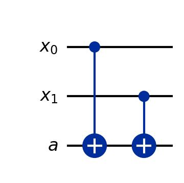

<!-- Question 1 -->

<!-- (a) Expliquez comment on peut encoder la contrainte sur la première ligne à l’aide d’un circuit avec un qubit ancillaire. -->

Soit un sudoku binaire 2x2:
<table>
  <tr>
    <td style="border: 1px solid #000; padding: 8px;">x0</td>
    <td style="border: 1px solid #000; padding: 8px;">x1</td>
  </tr>
  <tr>
    <td style="border: 1px solid #000; padding: 8px;">x2</td>
    <td style="border: 1px solid #000; padding: 8px;">x3</td>
  </tr>
</table>

La contrainte sur la première ligne est qu'il doit y avoir un seul 1 dans une des deux cases de la ligne.

Voici comment on peut exprimer cette contrainte:
 
x0 ⊕ x1 = 1

Le circuit qui fait l'équivalent de la porte XOR et qui encode la contrainte sur la première ligne est celui-ci:
 

  

